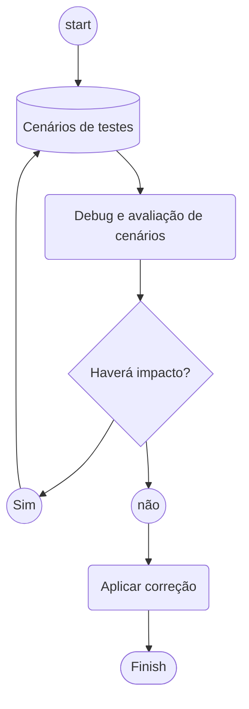

# ABAP 7.4 / Modern ABAP Development #

This repository contains examples and best practices for modern ABAP development using ABAP 7.4+ features. The goal is to demonstrate more efficient and cleaner ways to write ABAP code.

> Note: The examples are provided in both English and Portuguese to reach a wider audience.

## Development Guidelines
Before implementing any changes in your ABAP system, it's important to follow these testing guidelines:

## Features and Examples
This repository covers the following ABAP 7.4+ features:

### Groups in ABAP
One of the most powerful features in modern ABAP is the `GROUPS` functionality. While it can be challenging to master, it provides elegant solutions for data aggregation. See the [example implementation](/files/01-groups.abap).

### Alternative to COLLECT using REDUCE
While `COLLECT` is a traditional ABAP command, modern ABAP offers more readable alternatives using `REDUCE`. The example demonstrates how to:
1. Query a table using multiple filter values
2. Return all matching records
3. Identify which entries contain all specified filter fields

See the [complete implementation](/files/02-collect.abap) for both approaches.

### Date Handling
Modern date conversion and formatting techniques. Various approaches for different output formats are demonstrated in the [date examples](/files/03-date.abap).

### LET Expressions
Using `LET` expressions for improved code readability and maintainability. [See examples](/files/04-let.abap)

### Modern Loop Constructs
Efficient ways to handle iterations in modern ABAP. [See examples](/files/05-loop.abap)

### Range Operations
Simplified range handling and operations. [See examples](/files/06-range.abap)

### REDUCE Operations
Advanced use of `REDUCE` for data aggregation. [See examples](/files/07-reduce.abap)

### String Operations with REDUCE
Text processing using modern ABAP features. [See examples](/files/08-reduce_string.abap)

### Timestamp Handling
Modern approaches to timestamp operations. [See examples](/files/09-timestamp.abap)

### Table Comparison
Efficient methods to compare and find differences between tables. [See examples](/files/10-diff-sorted.abap)

### Field Mapping
Solutions for mapping fields between tables with different structures. [See examples](/files/11-mapping.abap)
