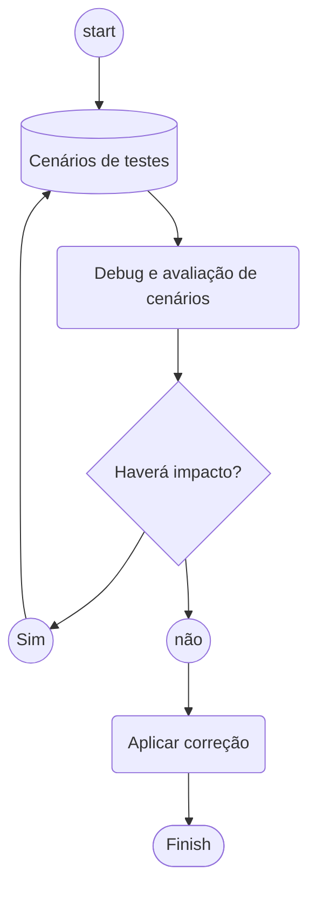

# ABAP 7.4 / Modern ABAP Development #


This repository contains examples and best practices for modern ABAP development using ABAP 7.4+ features. The goal is to demonstrate more efficient and cleaner ways to write ABAP code.

> Note: The examples are provided in both English and Portuguese to reach a wider audience.

## Development Guidelines
Before implementing any changes in your ABAP system, it's important to follow these testing guidelines:



## Features and Examples
This repository covers the following ABAP 7.4+ features:

### Groups in ABAP
One of the most powerful features for data grouping and aggregation. [See examples](/files/01-groups.abap)
```abap
DATA(lt_inc_cl_group) = VALUE tt_inc_cl_group(
  FOR GROUPS group OF <fs_inc_class> IN lt_inc_class
  GROUP BY ( classification_type = <fs_inc_class>-classification_type
             classification_category = <fs_inc_class>-classification_category )
  LET amount = REDUCE #( INIT amount_val TYPE f
                        FOR <group> IN GROUP group
                        NEXT amount_val += <group>-amount )
  IN ( classification_type = group-classification_type
       classification_category = group-classification-category
       amount = amount ) ).
```

### COLLECT and REDUCE Operations
Modern alternatives to traditional COLLECT. [See examples](/files/02-collect.abap)
```abap
lt_reduce = VALUE #(
  FOR GROUPS table OF <line> IN lt_data
  GROUP BY <line>-tabname
  ( tabname = table
    counter = REDUCE i( INIT i TYPE i
                       FOR ls_count IN GROUP table
                       NEXT i = i + 1 ) ) ).
```

### Date Formatting
Modern date formatting techniques. [See examples](/files/03-date.abap)
```abap
ls_out-date_creation = |{ ls_att-crdat DATE = USER }|.
ls_out-time_creation = |{ ls_att-crtim TIME = ISO }|.
```

### LET Expressions 
Using LET for improved readability. [See examples](/files/04-let.abap)
```abap
result1 = VALUE #(
  LET lt_temp = result1 IN
  FOR ls_temp IN lt_temp
  ( po    = ls_temp-po
    ccode = COND #( WHEN ls_temp-ccode EQ '0001'
                    THEN '0005'
                    ELSE ls_temp-ccode )
    uname = ls_temp-uname ) ).
```

### Loop Constructs
Modern loop patterns. [See examples](/files/05-loop.abap)
```abap
DATA(lt_final) = VALUE tab_out(
  FOR ls_item IN lt_items
    FOR ls_header IN lt_headers FROM line_index( lt_headers[ id = ls_item-id ] )
    WHERE ( id = ls_item-id )
    LET ls_final = VALUE ty_out( 
      id   = ls_header-id
      type = ls_header-type
      item = ls_item-item
      desc = ls_item-desc )
    IN ( CORRESPONDING #( BASE ( ls_final ) ls_item ) ) ).
```

### Range Operations
Simplified range handling. [See examples](/files/06-range.abap)
```abap
DATA(lt_range) = VALUE #(
  FOR groups vbeln OF wa IN lt_data
  GROUP BY wa-vbeln ASCENDING
  WITHOUT MEMBERS
  ( sign   = rsmds_c_sign-including
    option = rsmds_c_option-equal
    low    = vbeln ) ).
```

### REDUCE Operations
Data aggregation using REDUCE. [See examples](/files/07-reduce.abap)
```abap
DATA(lv_sum) = REDUCE menge_d( 
  INIT lv_menge TYPE menge_d
  FOR ls_mat IN GROUP components
  NEXT lv_menge = lv_menge + ls_mat-qtd_prevista ).
```

### String Operations
Text processing. [See examples](/files/08-reduce_string.abap)
```abap
DATA(text_class_uc) = REDUCE string(
  INIT text01 TYPE string
  FOR ls_out IN gt_output
  WHERE ( object = <fs_output>-object )
  NEXT text01 = COND #( 
    WHEN text01 IS INITIAL THEN ls_out-class_uc
    WHEN text01 NS ls_out-class_uc THEN text01 && '|' && ls_out-class_uc
    ELSE text01 ) ).
```

### Timestamp Operations
Modern timestamp handling. [See examples](/files/09-timestamp.abap)
```abap
CONVERT DATE date INTO TIME STAMP DATA(start_date) TIME ZONE space.
```

### Sorted Table Operations
Working with sorted tables. [See examples](/files/10-diff-sorted.abap)
```abap
DATA(lt_knbk_diff) = VALUE knbk_t(
  FOR ls_knbk IN COND #( 
    WHEN lines( lt_knbk1 ) >= lines( lt_knbk2 ) 
    THEN lt_knbk1 
    ELSE lt_knbk2 )
  ( LINES OF COND #(
      WHEN NOT line_exists( lt_knbk2[ table_line = ls_knbk ] ) 
      THEN VALUE #( ( ls_knbk ) ) ) ) ).
```

### Field Mapping
Advanced mapping techniques. [See examples](/files/11-mapping.abap)
```abap
DATA(lt_target) = CORRESPONDING tab_material( lt_source
                  MAPPING material = matnr ).
```

### Counting Operations
Efficient table counting. [See examples](/files/12-count.abap)
```abap
DATA(lt_group) = VALUE tab_sorted( 
  FOR GROUPS currency_group OF <line> IN lt_data
  GROUP BY <line>-currency ASCENDING
  ( currency = currency_group
    count    = REDUCE #( INIT int TYPE i 
                        FOR <group> IN lt_group
                        NEXT int = int + 1 ) ) ).
```

### Index Operations
Table indices. [See examples](/files/13-index.abap)
```abap
DATA(lt_target2) = VALUE gtt_struct2( 
  FOR lwa_source IN lt_source
  INDEX INTO index
  LET base = VALUE ty_struct2( field3 = index )
  IN ( CORRESPONDING #( BASE ( base ) lwa_source ) ) ).
```

### Split Operations
Modern splitting techniques. [See examples](/files/14-split.abap)
```abap
METHOD split_packages.
  WHILE lt_data_temp IS NOT INITIAL.
    result = VALUE tab_st_kssk_package(
      BASE result ( item = sy-index
      data = VALUE tab_st_kssk( 
        FOR wa IN lt_data_temp INDEX INTO i 
        FROM i + 1 TO i + 1
        ( LINES OF lt_data_temp 
          FROM i TO i + ( im_package - 1 ) ) ) ) ).
    DELETE lt_data_temp FROM 1 TO im_package.
  ENDWHILE.
ENDMETHOD.
```

### Package Processing
Large dataset handling. [See examples](/files/15-package.abap)
```abap
IF me->is_second_step( me->gv_second ) = abap_true
    OR me->is_allowed_for_simple_process( 
         im_package = lc_process_package_size
         im_data    = me->gt_kssk ).
  data_query_ausp( ).
  data_prepare_ausp( ).
ENDIF.
```

### Base Table Operations
Base table modifications. [See examples](/files/16-base.abap)
```abap
lt_item_list = VALUE #( 
  BASE lt_item_list
  ( LINES OF lt_item_list_single ) ).
```
