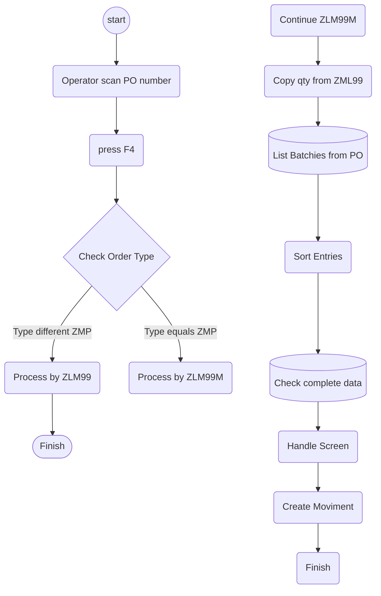

## Development test flow ##
Legend
- PO - Process Order
- Press F4 - Button to "NEXT" on the screen
- Qty - Confirmed Qty
- Sort Entries - Sort the entries by Flag Completed ascending and Batches ascending
- Post F4 - Button to "POST" on the screen that will be the creation of an Inbound Delivery (by `BAPI_GOODSMVT_CREATE` bapi)

